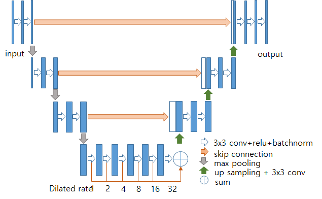
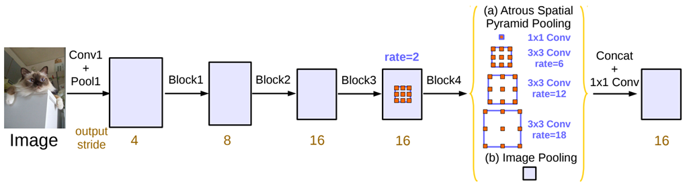
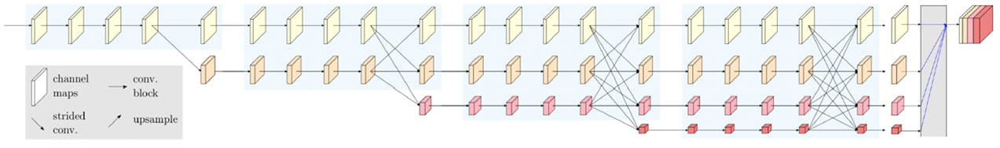
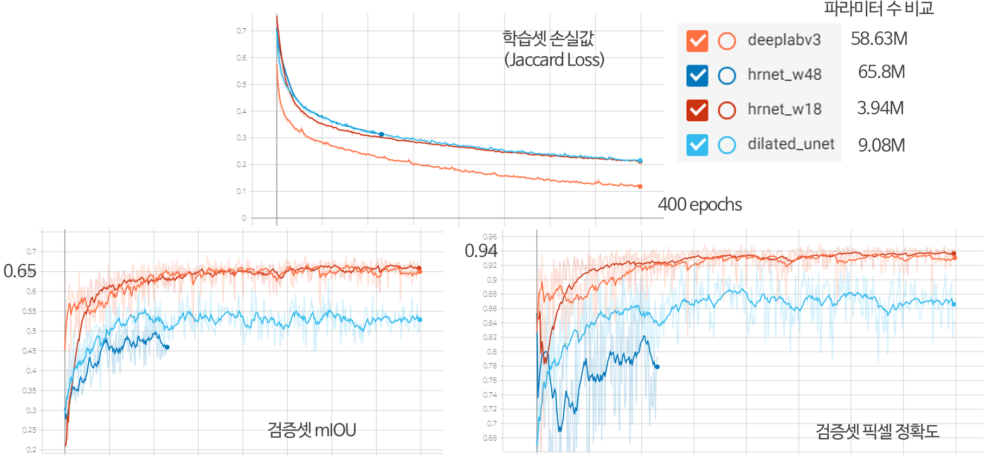

# KOMPSAT-3/3A 위성영상 기반 구름 검출 알고리즘


오한, 김보람 (한국항공우주연구원)

## 소개

원격 탐사 분야에서 구름의 식별과 추출은 광학 위성 영상을 분석하는 데 있어 매우 중요한 전처리 작업이다. 지금까지 구름을 추출하는 많은 방법이 제안되어 왔으나 대부분이 다중 분광 밴드의 개별적인 픽셀값에 의존하다 보니 다목적실용위성 3호/3A호 영상과 같이 제한된 수의 분광 정보를 가지는 경우 그 성능이 충분하지 않는 경우가 많았다. 그래서 본 프로젝트는 최신의 딥러닝 기술을 이용하여 다목적실용위성 3호/3A호 영상에서 구름 검출하는 알고리즘의 활용 방법을 다룬다. 


## 구름 검출

구름검출은 여러 컴퓨터 비전 문제중에 픽셀마다 라벨링을 수행하는 의미론적 분할(Semantic Segmentation)의 문제이다. 이 프로젝트에서는 현재까지 세 개의 딥러닝 알고리즘을 적용하여 성능을 비교하였다. 그 중 첫번째 알고리즘은 의미론적 분할 알고리즘 중 대표적인 U-Net[1]에 Dilated Convolution(또는 Atrous Convolution)을 추가로 적용해 다양한 수용 영역(receptive field)에서 정보를 찾는 Dilated U-Net[2]으로 구조는 다음과 같다. Kaggle Carvana Image Masking Challenge에서 좋은 성적을 거뒀던 알고리즘이다. 


는 --patch-size와 함께 숫자로 지정하면 되고 (예: --patch-size 800), --patch-stride는 이웃하는 패치간의 간격이다. 


두번째 알고리즘은 Deeplabv3 알고리즘[3]으로 여기에서는 101층의 ResNet[4]을 백본(backbone)으로 사용하고 비율 12, 24, 36의 Dilated Convolution을 병렬로 적용한 Atrous Spatial Pyramid Pooling(ASPP) Head를 가진다.





마지막 알고리즘은 Cityscape와 같은 의미론적 분할 데이터셋에서 좋은 성능을 보이고 있는 HRNetV2[4]를 적용하였다. HRNet은 고해상도 정보를 계속 유지하며, 한번에 하나씩 저해상도 영상을 만들고, 각 단계별로 여러 해상도 영상을 서로 병합하여 정보를 교환하는 특징을 가지고 있다.   





아래 그림은 구름 검출 데이터셋을 학습셋과 검증셋으로 7:3 비율로 분리하고 학습셋에 대해 400 epoch까지 학습한 결과를 나타낸다. 검증셋에 대해서 세가지 알고리즘 중  HRNet(W18 모델)과 Deeplabv3 알고리즘이 비슷한 성능을 보였다.




현재 시점에서는 위 세 알고리즘을 제공하지만 앞으로 계속적으로 새로운 알고리즘이 추가 될 예정이다.

 

## 설치 방법

본 프로젝트는 PyTorch 1.4버전 이상에서 작성하였으며 필요한 패키지는 cloud_seg.yml을 참고해 직접 설치하거나 아나콘다 환경에서 아래와 같이 바로 설치한다.

```
conda env create -f cloud_seg.yml
conda activate cloud_seg
```

### 디렉토리 구조

디렉토리의 구조는 다음과 같다.
다운로드 받은 kari_cloud 데이터셋은 data 폴더 아래에 놓이도록 한다. 

```bash
kari_cloud_seg
├── data
│   ├── kari_cloud 
│   └── caches   ├── img 
│                │     ├── tif
│                │     └── png
│                └── label  
├── models
├── readme
├── utils
├── outputs
├── runs
└── weights
```


## 학습 및 추론 

기본적인 학습 방법(배치 사이즈 16에 200 epoch까지 학습)은 다음과 같다. 

```
python train.py --batch-size 16 --epoch 200 --name first_run
```

기본 모델은 `deeplabv3` 알고리즘이 사용되며, 만약 다른 알고리즘은 쓰고자 하면 `--model`과 함께 `dilated_unet` 또는 `hrnet_w18`, `hrnet_w48` 이라고 지정한다.
기본 입력 패치의 크기(`patch-size`)는 800에 인접하는 패치간의 간격(`patch-stride` )은 400이다. 
기본 손실함수는 `dice`이며 다른 손실함수를 쓰려면 `--loss`와 함께 `ce`, `jaccard`로 지정하면 된다.

그 외 사용법은 `--help`를 치면 나온다.

추론 방법은 다음과 같다.

```
python predict.py -i sample0.tif sample1.tif --weights ./weights/deeplabv3_best.pt
```

추론할 때 쓰일 weight 값은 `--weights` 옵션과 함께 파일을 지정한다. 입력은 여러 개를 연달아 적을 수 있다.


## 참고문헌

[1] O. Ronneberger, P. Fischer, and T. Brox, "U-Net: Convolutional Networks for Biomedical Image Segmentation," MICCAI, 2015.

[2] https://www.kaggle.com/c/carvana-image-masking-challenge/discussion/40199

[3] L.-C. Chen, G. Papandreou, F. Schroff, and H. Adam, “Rethinking Atrous Convolution for Sementatic Image Segmentation,” arXiv: 1706.05587v3, 2017. 